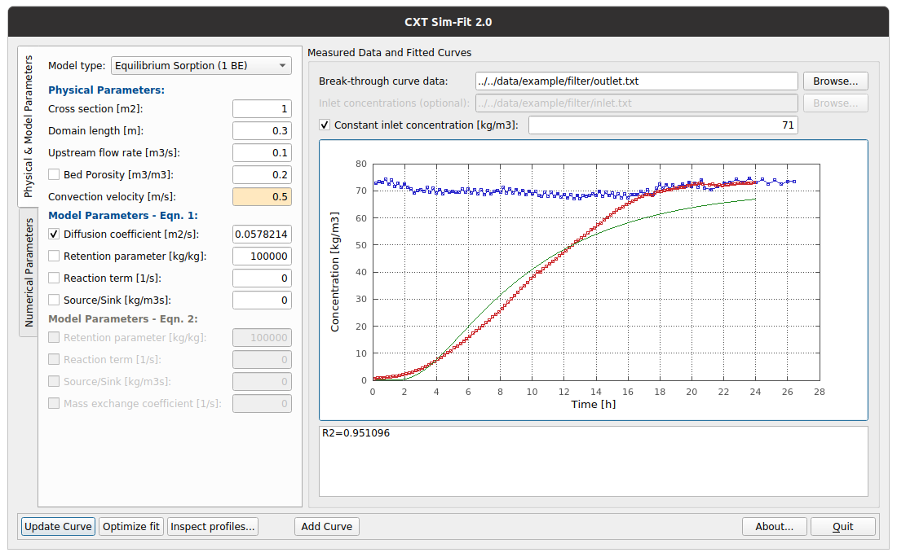
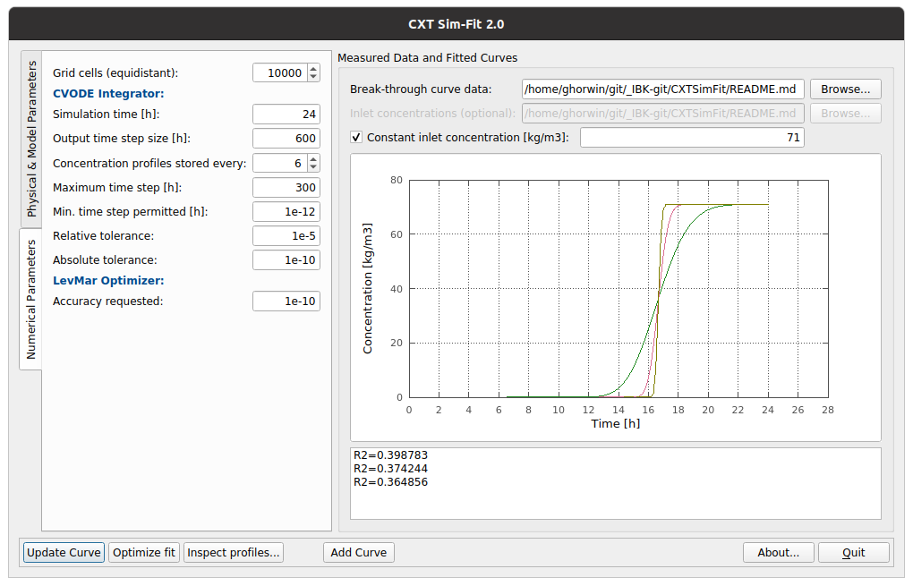
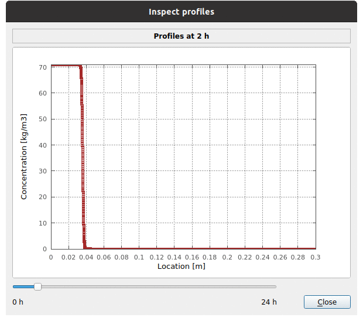
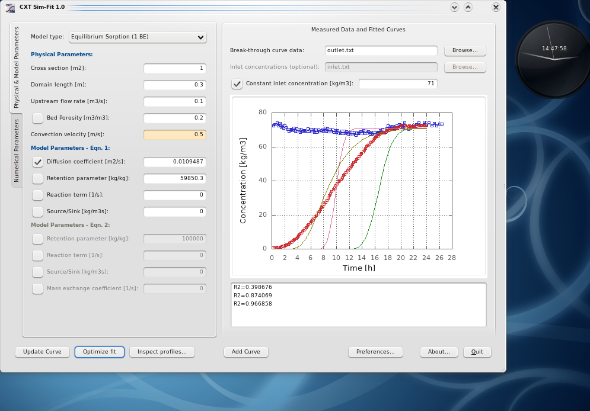
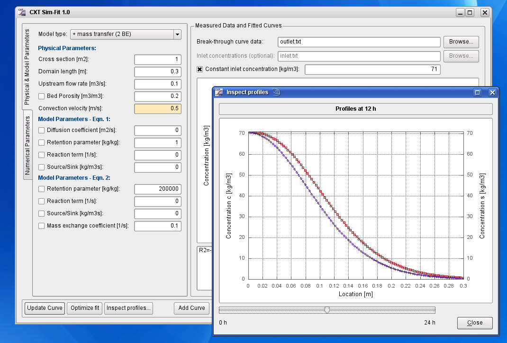
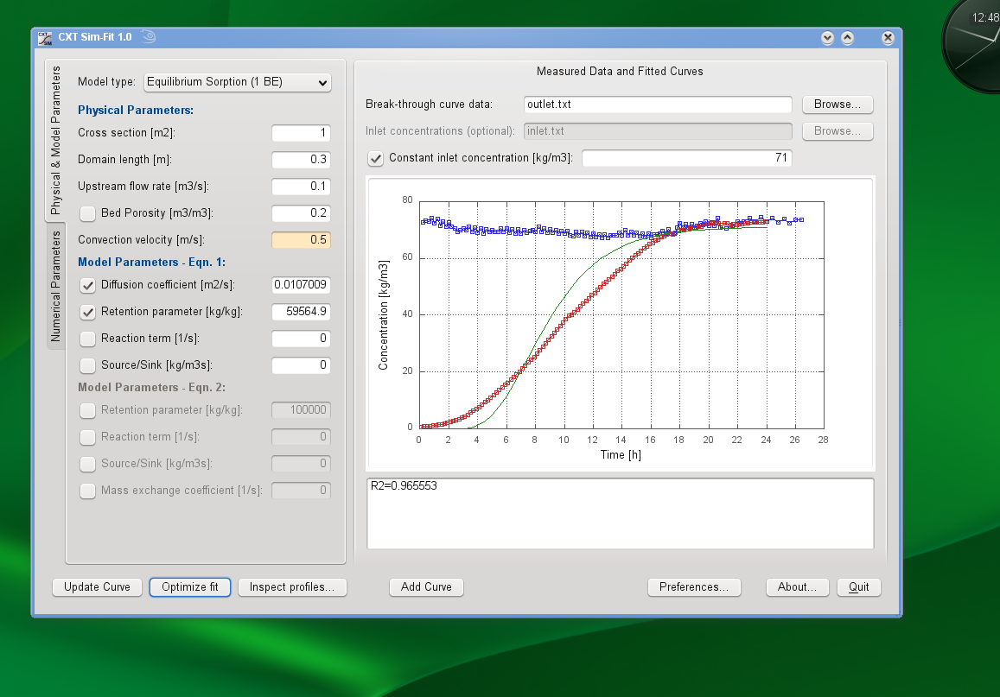
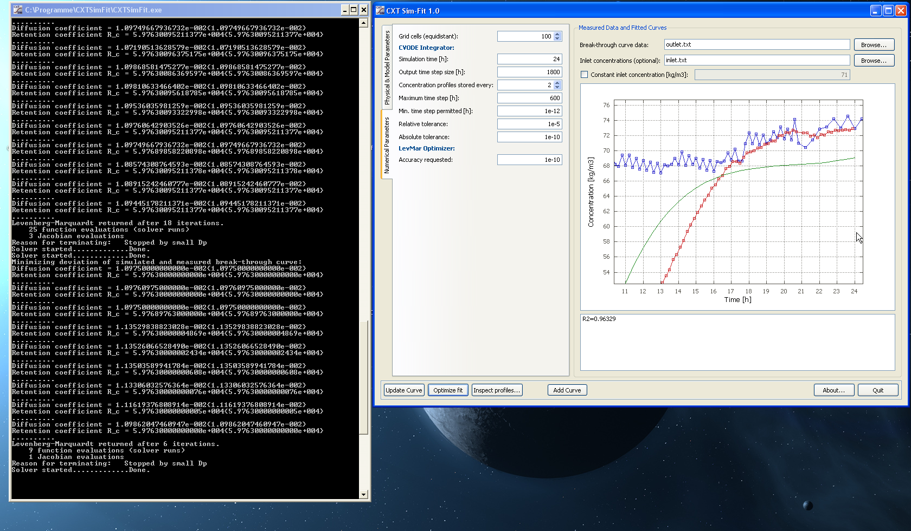

# CXTSimFit

_CXTSimFit_ is a small tool to determine model parameters through inverse modeling of Tracer experiments (or filter tests). It fits the parameters of a typical diffusion and convection equation (with sorption and source term, and optional dual porosity) to measured inlet/outlet data. As opposed to the original CXTFit (see reference below) it can handle much more complex equations and handle non-constant inlet conditions.

Paper of the original CXTFIT:

_The CXTFIT Code for Estimating Transport Parameters from Laboratory or Field Tracer Experiments_, Research Report No. 137, April 1999, N. Toride, F. J. Leij, and M. Th. van Genuchten, https://www.ars.usda.gov/arsuserfiles/20360500/pdf_pubs/P1444.pdf

**NOTE/DISCLAIMER** Neither the CXTSimFit code nor the model formulation or anything else in this repository is related to or uses material from the original code/model. The purpose of the software is, however, very similar, hence the similar naming.

## Features

This is a re-design of the original CXTFit software using a modern PDE solver to support measured, variable concentration pulses. Internally, it uses the CVODE integrator (SUNDIALS Suite) with error-controlled adaptive time integration. The sample is automatically discretized (equidistant) and the progression of the concentration pulse is simulated dynamically.

Also, a dual-porosity model is implemented, to better capture sorption characteristics in filters. Actually, the program was initially developed to analyze VOC filter bed model parameters obtained from break-through measurements (done by Prof. Jensen Zhang and his group at [BEESL group @ Syracuse University, NY, USA](https://beesl.syr.edu). Since the physics is very typical for other problems (like salt diffusion/convection Tracer tests), the tool can be used likewise for such problems.

## Documentation

The mathematical theory is written down in a small paper: [CXTSimFit Manual](doc/cxtsimfit_manual.pdf)

## How does it work

The software computes the solution of the convection-diffusion-equation (see model description in the manual). When you run the software, you can enter the model parameters, run the simulation and plot the calculated results with the "Add curve" button:

This functionality is great for testing the impact of various model parameters, and also numerical parameters such as the number of grid cells. For example, the solution of the pure convection equation with 100, 1000 and 10000 cells shows the typical numerical diffusion/dispersion effect:

For each calculated and added curve, you can inspect the progression of the convection/diffusion front, using the "Inspect profiles..." dialog:

## Curve Fitting

You can now select one or more model parameters (check the check boxes) to determine via _inverse modeling_. This procedure involves running a simulation with some set of parameters, evaluating the difference between calculated and provided break-through curve and then using the [Levenberg-Marquardt](https://en.wikipedia.org/wiki/Levenberg–Marquardt_algorithm) to optimize the parameters.

As with all non-linear optimization algorithms, a good set of starting values will help. Also, adjusting first a few parameters and adding the others later, might give better results.

### Checking/evaluating typical Inverse Modeling errors

The software can be used very well in teaching problems appearing with _Inverse Modeling_. For example, a frequent mistake in papers related to _inverse modeling_ is the mixup of numerical effects on results with physical parameters, most notably the diffusion coefficient. Try to fit a perfect analytical break-through curve with a coarse and fine grid - the algorithm will give you near perfect fit in both cases, yet with _different_ diffusion coefficients. 

So, when you read a paper with parameters determined through inverse modeling and numerical simulation, and the author _does not_ discuss impact of numerical parameters, then the presented results are likely garbarge or unreliable at best.

## Authors

The tool was a small side project that I (Andreas Nicolai) developed while writing my PhD at [Syracuse University](https://www.syracuse.edu) in the [BEESL group](https://beesl.syr.edu) together with my colleague Jing Jing Pei. 
(Btw, sorry, Jing Jing, that I made you listen to all my boring explanations on numerics and C++ programming :-)

# Old Screenshots

Mind, this software was first published in 2009/2010, hence the screenshots show OS versions that are now long out of date. However, I still like the window manager decorations and color schemes from back then :-)

### Kubuntu 8.10

### OpenSuse 10.3

### OpenSuse 11.1

### Windows XP

